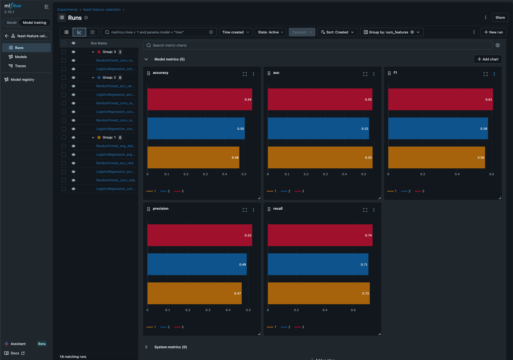

# Feast + MLflow Feature Selection Demo

This demo showcases how to use [Feast](https://feast.dev/) and [MLflow](https://mlflow.org/) together for feature engineering and model experimentation. It demonstrates the complete workflow from feature definition to model comparison, based on the blog post ["Feast + MLflow + Kubeflow: A Unified AI/ML Lifecycle"](https://feast.dev/blog/feast-mlflow-kubeflow).

## What This Demo Shows

1. **Feature Engineering with Feast**: Define, register, and serve features consistently
2. **Feature Selection with MLflow**: Compare model performance across different feature combinations
3. **Online/Offline Feature Store**: Historical features for training, real-time features for inference
4. **Experiment Tracking**: Log and compare 14+ experiments to find the best feature set

## Key Insight

The demo reveals a counterintuitive finding through systematic experimentation:

| Features | Model | AUC |
|----------|-------|-----|
| `acc_rate` only | LogisticRegression | **0.645** |
| `acc_rate` + `avg_daily_trips` | LogisticRegression | 0.613 |
| All 3 features | LogisticRegression | 0.570 |

**A single feature outperformed the full feature set** - exactly the kind of insight MLflow's experiment comparison is built to discover.

## Setup

### Prerequisites
- Python 3.10+
- [uv](https://docs.astral.sh/uv/) (recommended) or pip

### Installation

```bash
# Create virtual environment
uv venv .venv
source .venv/bin/activate  # On Windows: .venv\Scripts\activate

# Install dependencies
uv pip install feast mlflow scikit-learn pandas pyarrow
```

## Running the Demo

### 1. Generate Sample Data
```bash
python create_sample_data.py
```
This creates sample driver statistics and labels in the `data/` directory.

### 2. Apply Feast Feature Definitions
```bash
feast apply
```
This registers the feature views and entities with Feast.

### 3. Run Feature Selection Experiments
```bash
python demo.py
```

This will:
- Retrieve historical features from Feast
- Run 14 experiments comparing different feature combinations
- Show experiment results ranked by AUC
- Materialize features to the online store
- Test real-time feature retrieval

### 4. View Results in MLflow UI
```bash
mlflow ui --port 5000
```

Open http://localhost:5000 to explore:
- **Experiment comparison**: Sort runs by AUC, accuracy, etc.
- **Feature filtering**: Filter runs by which features were included
- **Metrics visualization**: Plot performance across experiments
- **Model artifacts**: Download trained models and configs



The MLflow UI shows model performance metrics (accuracy, AUC, F1, precision, recall) grouped by number of features used. You can instantly see which feature combinations perform best and identify patterns like diminishing returns from additional features.

## Project Structure

```
mlflow-feast/
├── README.md                   # This file
├── feature_store.yaml          # Feast configuration
├── feature_definitions.py      # Feast feature views and entities
├── create_sample_data.py       # Generate sample datasets
├── demo.py                     # Main demo script
├── data/                       # Generated datasets
│   ├── driver_stats.parquet    # Driver feature data
│   ├── driver_labels.parquet   # Training labels
│   ├── registry.pb             # Feast registry
│   └── online_store.db         # SQLite online store
└── mlruns/                     # MLflow experiment data
```

## Key Files

- **`feature_definitions.py`**: Defines Feast features including driver conversion rate, accuracy rate, and trip counts
- **`demo.py`**: Runs systematic feature selection experiments and logs everything to MLflow
- **`feature_store.yaml`**: Configures Feast with local SQLite online store and file-based offline store

## Feast Features Defined

- **Entity**: `driver_id` (INT64)
- **Feature View**: `driver_hourly_stats`
  - `conv_rate`: Driver conversion rate (0-1)
  - `acc_rate`: Driver accuracy rate (0-1)
  - `avg_daily_trips`: Average daily trips (1-50)
- **On-Demand Feature**: `conv_acc_ratio` (derived transformation)

## MLflow Experiments

The demo creates experiments in MLflow with:
- **Parameters**: Feature combinations, model type, dataset sizes
- **Metrics**: AUC, accuracy, precision, recall, F1-score
- **Tags**: Individual features for easy filtering (`feature_acc_rate: included`)
- **Artifacts**: Trained models, Feast config, training data samples

## Use Cases

This pattern is useful for:
- **Feature selection**: Systematically test which features improve model performance
- **Model comparison**: Compare different algorithms on the same feature sets
- **A/B testing**: Track model performance changes as you add/remove features
- **Reproducibility**: Ensure the same features are used in training and serving

## Extending the Demo

Try these modifications:
1. Add more features to `feature_definitions.py`
2. Test different model types in `demo.py`
3. Add hyperparameter tuning with MLflow + Optuna
4. Set up feature monitoring with Feast's data quality features
5. Deploy the best model with the online feature store

## Technologies Used

- **Feast 0.60.0**: Feature store for consistent offline/online feature serving
- **MLflow 3.10.1**: Experiment tracking, model registry, and comparison
- **scikit-learn**: Model training and evaluation
- **pandas/PyArrow**: Data processing and storage